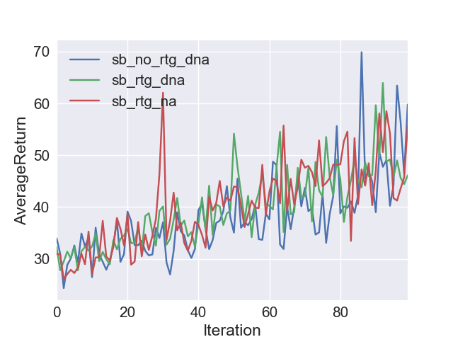
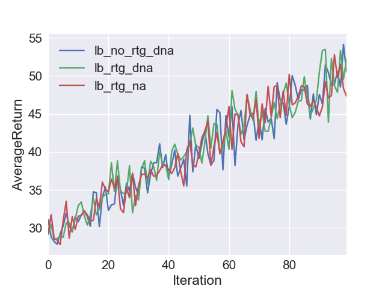
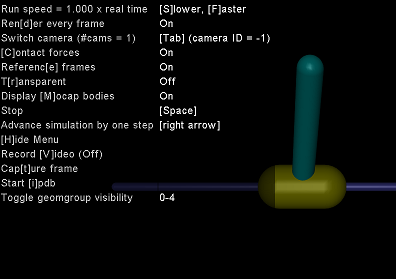
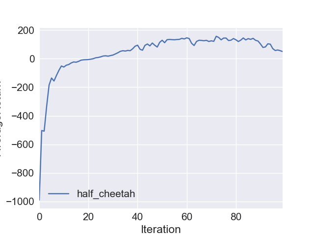

Deep Reinforcement Learning Based Control in Continuous Action and State Spaces using Policy Gradients and Actor-Critic Networks
================================
 

## How To Use


**Dependencies**

-TensorFlow   
-MuJoCo version 1.31 /1.51  
-OpenAI Gym  
-OpenCV
-Microsoft Visual C++ 

 **Usage**

```
python train_pg.py InvertedPendulum-v2 --render -n 100 -b 5000 -e 5 -rtg --exp_name lb_continuous_5_layered_DeepNeuralNet -l 3 -lr 1e-2
```

**Detailed Instructions**


## Experiments

 
###Cart Pole with Discrete Action
 

The [cart-pole model](http://www.derongliu.org/adp/adp-cdrom/Barto1983.pdf) has four state variables


**Observation 1**: Comparing Fig 1 and Fig 2, it is clear that having a larger
    batch size helps in faster learning and better policies in terms of Average
    Returns.

**Observation 2**: From Fig 3 it is clear that when we push up the probability of picking action at in state st in proportion to the ‘reward-to-go’ from that state-action pair—the sum of rewards achieved by starting in st, taking action at, and then acting according to the current policy forever after, rather than a trajectory centric policy gives much better policies.

Also Advantage normalization gives slightly better policies.

**Observation 3**: However having a baseline didn’t improve the policy as expected as shown in figure 3.



Figure 1



Figure 2


Figure 3


Figure 4

 

###Inverted Pendulum with Continuous Actions

 Command Line Code
```
python train_pg.py InvertedPendulum-v2 --render -n 100 -b 5000 -e 5 -rtg --exp_name lb_continuous_5_layered_DeepNeuralNet -l 3 -lr 1e-2
```




 

Figure 5

 **Observation 1:** The learning curves with two different network architectures
    is shown in Fig 6. Its clear from the graph that the 5 layered feed forward
    neural network learned better policies in lesser number of iterations.


Figure 6

 

###HALF CHEETAH

Code Block

```
python train_pg.py HalfCheetah-v2 -ep 150 --discount 0.9 -b 40000 -rtg -l 3 -s 32 -lr 4e-2 --exp_name half_cheetah
```

[Half-Cheetah](http://prac.elka.pw.edu.pl//~pwawrzyn/pub-s/0601_SLEAC.pdf), is a planar kinematic string of 9 links and 10 joints; the
“paws” of Half-Cheetah will also be called joints. The angles of 4-th and 5-th
joint are fixed, all the the others are controllable. Consequently, Half-Cheetah
is a 6-degree-of-freedom walking robot.

 


Figure 7



Figure 8


**Observation 1:** After a lot of hyper parameter tuning, the settings that gave
an average return above 150 before 100 iterations is given in the code block
below. It used an unusually high batch size and a 5 layered deep neural network
without a critic.

 

 

### REFERENCES

 

1. Paweł Wawrzynski, [Learning to Control a 6-Degree-of-Freedom Walking Robot](http://prac.elka.pw.edu.pl//~pwawrzyn/pub-s/0601_SLEAC.pdf) 

2. A. G. Barto, R. S. Sutton, and C. W. Anderson, [“Neuronlike adaptive elements
that can solve difficult learning control problems”](
http://www.derongliu.org/adp/adp-cdrom/Barto1983.pdf)

 

 
