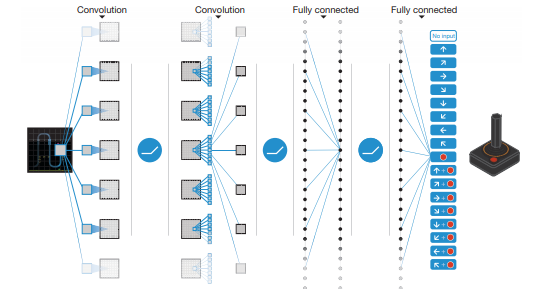
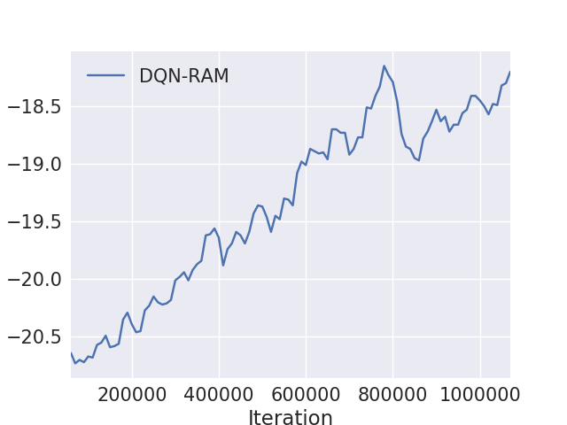
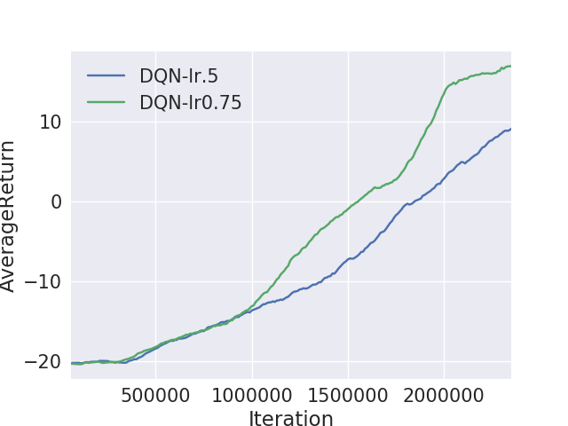
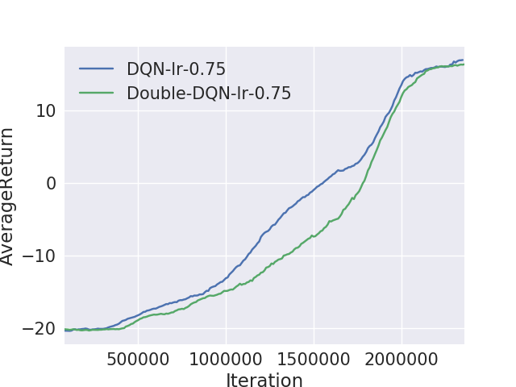

Reinforcement Learning Based Control using High Dimensional Sensory Inputs - Deep Q Learning and Deep Double Q Learning
============================================================================================


 
## How To Use


**Dependencies**

-TensorFlow   
-atari-py  
-OpenAI Gym  
-OpenCV
-Microsoft Visual C++ 

 **Usage**

```
python run_dqn_atari.py
```

## Introduction:

Q-learning is a model-free algorithm. It doesn't assume anything about state-transition probabilities. Neither does it tries to learn these transitions. It estimates the good and bad actions based on trial and error by sampling actions and recieving rewards.The optimal state-action value function obey an important identity known as Bellman equation, which corresponds to an implicit optimal policy.

%3DR(s%2Ca)%2B\gamma\max_{a%27}Q^{*}(s%27%2Ca%27))


The basic idea is to estimate the action value function, by using the Bellman equation as iterative update.


The online Q-learning mentioned above has some challenges, which makes it difficult to converge.

1. Strongly corelated samples over successive iterations.
	- To remove the correlation between samples, [Playing Atari with Deep Reinforcement Learning](https://www.cs.toronto.edu/~vmnih/docs/dqn.pdf) paper suggested using a buffer called Experience-replay buffe, where we store the agent's experiences at each time-step, pooled over many episodes. Select a mini-batch of samples everytime to make an update.
2. Trying to catch a moving target, i.e. target value is a function of traget itself
	- To make the targets in the inner loop as constants, use the target networks to generate the targets and update the target networks only once in a while. This way, we are trying to catch stationary targets for a while.
3. Exploration vs exploitation problem: How to select actions during training? Should the agent trust the learnt values to select actions? or try some other options hoping they may give better rewards.
	- Use espilon-greedy approach. The agent will pick a random action with probability epsilon and the action according to the current estimates with probability 1-epsilon. Start with an exploration schedule that assigns large value to epsilon initially and reduces the value over iterations. 


**[Detailed Instructions](http://rail.eecs.berkeley.edu/deeprlcourse-fa17/f17docs/hw3.pdf)**
 
## Experiment 1: Find Control Policies for playing Atari-2600 Pong directly from Pixels 

The game of Pong is an excellent example of a simple RL task. In the ATARI 2600 version we’ll use you play as one of the paddles (the other is controlled by a decent AI) and you have to bounce the ball past the other player.On the low level the game works as follows: we receive an image frame (a 210x160x3 byte array (integers from 0 to 255 giving pixel values)) and we get to decide if we want to move the paddle UP or DOWN (i.e. a binary choice). After every single choice the game simulator executes the action and gives us a reward: Either a +1 reward if the ball went past the opponent, a -1 reward if we missed the ball, or 0 otherwise. And of course, our goal is to move the paddle so that we get lots of reward.


**Pre-procesing**

As given in the DeepMind [Playing Atari with Deep Reinforcement Learning](https://www.cs.toronto.edu/~vmnih/docs/dqn.pdf) paper:
>Working directly with raw Atari frames, which are 210 × 160 pixel images with a 128 color palette,
can be computationally demanding, so we apply a basic preprocessing step aimed at reducing the
input dimensionality. The raw frames are preprocessed by first converting their RGB representation
to gray-scale and down-sampling it to a 110×84 image. The final input representation is obtained by
cropping an 84 × 84 region of the image that roughly captures the playing area.

**Network Architecture**


Figure 1


**Observation 1 - Convergence**

The implementation of the DQN with Piecewise linear schedule learning rate and exploration(epsilon greedy) converged as expected as shown in figure 2, indicating that our implementation is correct. The experiments were run on the lightweight version(states emulator RAM instead of images) initially.The experiment was run for 1 million time steps. 


Figure 2

**Observation 2 - Hyperparameters**

As shown in figure 3, a learning rate multiplier of 0.75 gave much better learning performance(in terms of convergence rate) than higher learning rates of 0.5. For the default rate of 1, the system actually diverged in this implementation.  
 Also using a Huber Loss rather than the mean-squared loss also made a huge difference, though learning curve is not plotted for the same.


Figure 3

## Experiment 2: Improving Performance using Double Q Learning
 
The popular Deep Q-learning algorithm is known to overestimate
action values under certain conditions.This makes it more likely to select overestimated
values, resulting in overoptimistic value estimates. 

To prevent
this, double DQN can decouple the selection from the evaluation.In double DQN use the current network(not the target network) to select actions in the Q Learning Bellman Equation, and use the target network to select the action values.  


Equation [1](https://docs.google.com/document/d/1Iw_TUijQ-C6F0M3mWWco8_rDiuEblKvtr8mCB3ITLas/edit#bookmark=id.o1wk0u1ffpzv)

As shown in figure below, for the same learning rate, the Double DQN seems to be picking up with the DQN Learning in the final stages of learning and can possible outperform with more training steps(currently not performed) as shown in the [paper](file:///C:/Users/DELL/Downloads/12389-55999-1-PB.pdf). 





Figure 4: Graph from our experiments(above) and [paper](file:///C:/Users/DELL/Downloads/12389-55999-1-PB.pdf)(below).

## REFERENCES

1. Volodymyr Mnih et all [Playing Atari with Deep Reinforcement Learning](https://www.cs.toronto.edu/~vmnih/docs/dqn.pdf) 

2. Volodymyr Mnih et all [“Human-level control through deep reinforcement
learning”](
https://storage.googleapis.com/deepmind-data/assets/papers/DeepMindNature14236Paper.pdf)

3. Adrien Lucas Ecoffet's [Blog](https://becominghuman.ai/lets-build-an-atari-ai-part-1-dqn-df57e8ff3b26)

4. Andrej Karpathy's [Blog](http://karpathy.github.io/2016/05/31/rl/)

5. Van Hasselt, Guez, Silver. [Deep reinforcement learning with double Q-learning: a
very effective trick to improve performance of deep Q-learning.](file:///C:/Users/DELL/Downloads/12389-55999-1-PB.pdf)

6. CS 294: Deep Reinforcement Learning, Fall 2017


 

 

 

 
