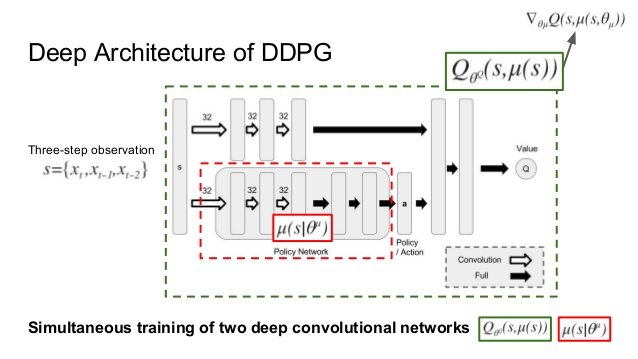
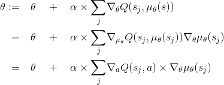

# USING OPENAI-BASELINES

This implementation of ddpg is based on openai baselines.

**Installing**

Go to Anaconda Command Prompt and run the following commands

```
git clone https://github.com/openai/baselines.git
  ```

```
cd baselines
  ```

```
pip install -e .
  ```

**Dependencies**:

- TensorFlow
- scipy

**Important Files**

- [model.py](baselines/baselines/ddpg/model.py) : change this to choose different architectures
- [mujoco.py](mujocoInvertedPend.py) : to use different mujoco environments(write your own python file in similar manner for other environments). Here you can choose different hyperparameters, the defaults are carefully choosen with respect to inverted pendulum task.
- [training.py](baselines/baselines/ddpg/training.py)
- [ddpg.py](baselines/baselines/ddpg/ddpg.py)

DDPG: Deep Deterministic Policy Gradients
---------------

You can find a detailed blog on this by me in [here](https://vaisakh-shaj.github.io/posts/2018/06/DDPG/).


**DDPG:** can be interpreted in terms of Q Learning and Policy Gradients Literature. In terms of Q Learning, it tends to use a <span style="color:#FF0000">function approximator</span>  for solving the max in the Bellman Equation of Q Learning(**approximate Q Learning Method**).

This is achieved by learning a deterministic policy  using an actor neural net
 and updating the policy parameters by moving them in the direction of the gradient of the action-value function.


Equation [1](https://www.codecogs.com/eqnedit.php?latex=\begin{aligned}%20\theta%20:=\quad&%20\theta\quad%20+%20\quad%20\alpha\times\underset{j}{\sum}\nabla_\theta%20Q(s_j,\mu_\theta(s))%20\\%20=\quad%20&%20\theta%20\quad%20+%20\quad%20\alpha\times\underset{j}{\sum}\nabla_{\mu_\theta}%20Q(s_j,\mu_\theta(s_j))%20\nabla_{\theta}\mu_\theta(s_j)%20\\%20=\quad%20&%20\theta%20\quad+\quad\alpha\times\underset{j}{\sum}\nabla_{a}%20Q(s_j,a)\times\nabla_{\theta}\mu_\theta(s_j)%20\end{aligned})

The above update rule is a special limiting case of the Policy Gradient theorem and its convergence to a locally optimal policy is proven. This is the policy gradient explanation of the algorithm and hence the name DD-Policy Gradient(For more details refer [2]).

 Experiment 1: Expected Reward vs Iterations for Continuous Control tasks
 -------------

For the 'InvertedPendulum-v2' task we see that the algorithm converging to good solution in about iterations. Here
Exploration is achieved by adding noise to the actor input.

- Carefully Chosen Default Parameters for stable Learning can be in the file [mujocoInvertedPend.py](mujocoInvertedPend.py)
- Model Architecture can be found in the file [model.py](baselines/baselines/ddpg/model.py)
- Experimented by adding dropout and LeakyReLU in the architecture

**Observation** : As show in the figure, addition of dropout and LeakyReLU(instead of Relu), significantly improved the quality of learning(in terms of learning rate and stability)


References
--------
1. Sutton et all. 1998 [Policy Gradient Methods for RL with Function Approximation]( https://papers.nips.cc/paper/1713-policy-gradient-methods-for-reinforcement-learning-with-function-approximation.pdf)
2. Silvet et all. 2016 [Deterministic Policy Gradient Algorithms
  ](http://proceedings.mlr.press/v32/silver14.pdf)
3. [DDPG Blog](http://pemami4911.github.io/blog/2016/08/21/ddpg-rl.html)
